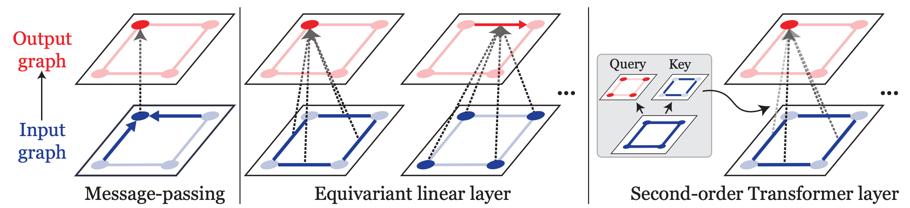
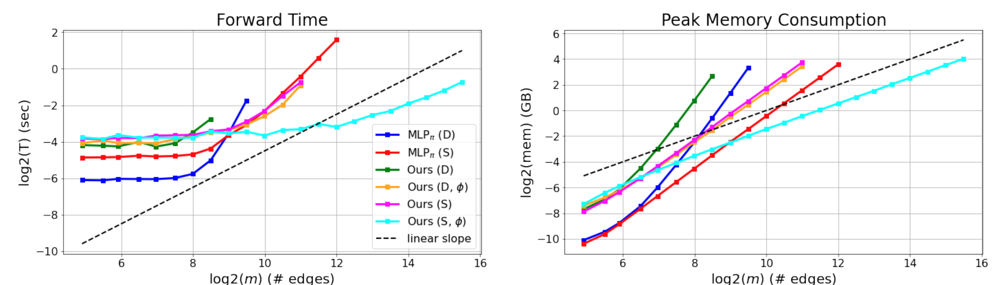

# Higher-Order Transformers (PyTorch)

[**Transformers Generalize DeepSets and Can be Extended to Graphs and Hypergraphs**](https://arxiv.org/abs/2110.14416) \
[Jinwoo Kim](https://bit.ly/3pPuyIb), [Saeyoon Oh](https://github.com/saeyoon17), [Seunghoon Hong](https://maga33.github.io/) @ [KAIST](https://www.kaist.ac.kr/en/) \
NeurIPS 2021

[](https://arxiv.org/abs/2110.14416)
[](https://paperswithcode.com/sota/graph-regression-on-pcqm4m-lsc?p=transformers-generalize-deepsets-and-can-be)




In this repository, we provide PyTorch implementations of:
- Up-to-second-order Transformer layers ({set, graph} input × {set, graph, vector} output)
- A span of their variants ({dense, sparse} data × {softmax, kernel} attention)
- Corresponding equivariant linear layers as baselines
- A special extension for higher-order hyperedge prediction (set input, *k*-hyperedges output)

In practice, we recommend to use the **sparse kernel variant** as it scales linearly to data size while still being powerful.

## How do I use Higher-Order Transformers for my project?
Go to your repository and execute the following.
```bash
# this is enough
pip install torch>=1.8.1

# add this repository as a submodule
git submodule add https://github.com/jw9730/hot hot
git submodule init

# run basic tests
cd hot
python3 run_tests.py
cd ..
```

For basic use cases, please see `run_perf_tests.py` and `run_tests.py`.

To update the code, execute the following:
```bash
git submodule update --remote --merge
```

## Setting up experiments
```bash
# using Docker
git clone https://github.com/jw9730/hot.git hot
cd hot
docker build --no-cache --tag hot:latest .
docker run -it --gpus all --ipc=host --name=hot -v /home:/home hot:latest bash
# upon completion, you should be at /hot inside the container
```
```bash
# using pip
git clone https://github.com/jw9730/hot.git hot
cd hot
pip3 install torch==1.8.1+cu111 torchvision==0.9.1+cu111 torchaudio==0.8.1 -f https://download.pytorch.org/whl/torch_stable.html
pip install -r requirements.txt
pip install torch-sparse==0.6.9 torch-scatter==2.0.6 -f https://data.pyg.org/whl/torch-1.8.0+cu111.html
pip install torch-geometric==1.6.3
```

## Running experiments
```bash
# Runtime and memory analysis
python3 run_perf_tests.py
```
```bash
# PCQM4M-LSC graph regression
cd regression/examples/pcqm4m-lsc

# Second-Order Transformers (sparse kernel)
bash enc.sh
bash enc-small.sh

# Comparison with more baselines
bash enc-short.sh
bash enc-small-short.sh

# Second-Order MLP
bash mlp-short.sh

# Vanilla Transformer + Laplacian PE
bash laplacian-short.sh
```
```bash
# set-to-graph prediction
cd set-to-graph/main
python download_jets_data.py
cd ../examples

# Delaunay (50)
cd delaunay-a
bash enc-kernel.sh
bash enc-softmax.sh
bash s2g.sh
# visualize
bash visualize-kernel.sh
bash visualize-softmax.sh

# Delaunay (20-80)
cd ../delaunay-b
bash enc-kernel.sh
bash enc-softmax.sh
bash s2g.sh
# visualize
bash visualize-kernel.sh
bash visualize-softmax.sh

# Jets
cd ../jets
bash enc-kernel.sh
bash enc-softmax.sh
# test
bash test-enc-kernel.sh
bash test-enc-softmax.sh
```
```bash
# k-uniform hyperedge prediction
cd k-uniform-hyperedge/examples

# GPS
cd gps
bash enc.sh
bash s2g+.sh
bash hyper-sagnn-e.sh
bash hyper-sagnn-w.sh

# MovieLens
cd ../movielens
bash enc.sh
bash s2g+.sh
bash hyper-sagnn-e.sh
bash hyper-sagnn-w.sh

# Drug
cd ../drug
bash enc.sh
bash s2g+.sh
bash hyper-sagnn-e.sh
bash hyper-sagnn-w.sh
```

## References
This implementation uses code from the following repositories:
- [Performer](https://github.com/lucidrains/performer-pytorch.git) for FAVOR+ attention kernel
- [Graph Transformer](https://github.com/graphdeeplearning/graphtransformer.git) for Laplacian PE of baseline model
- [Graphormer](https://github.com/microsoft/Graphormer.git) for graph regression experiment
- [Set2Graph](https://github.com/hadarser/SetToGraphPaper.git) for set-to-graph prediction experiment
- [Hyper-SAGNN](https://github.com/ma-compbio/Hyper-SAGNN.git) for k-uniform hyperedge prediction experiment

## Citation
If you find our work useful, please consider citing it:
```bib
@article{kim2021transformers,
  author    = {Jinwoo Kim and Saeyoon Oh and Seunghoon Hong},
  title     = {Transformers Generalize DeepSets and Can be Extended to Graphs and Hypergraphs},
  journal   = {arXiv},
  volume    = {abs/2110.14416},
  year      = {2021},
  url       = {https://arxiv.org/abs/2110.14416}
}
```
